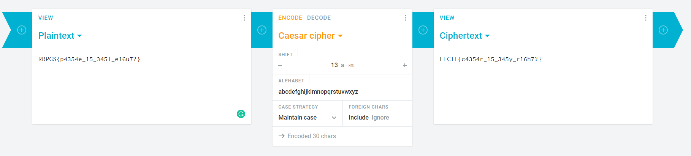

## Classic Cipher (50 points)

In this question, we got the encrypted flag:

RRPGS{p4354e_15_345l_e16u7?}

Such that, we can simply use the online tool to help us with the key=13

Then, we can get the flag:

EECTF{c4354r_15_345y_r16h7?}