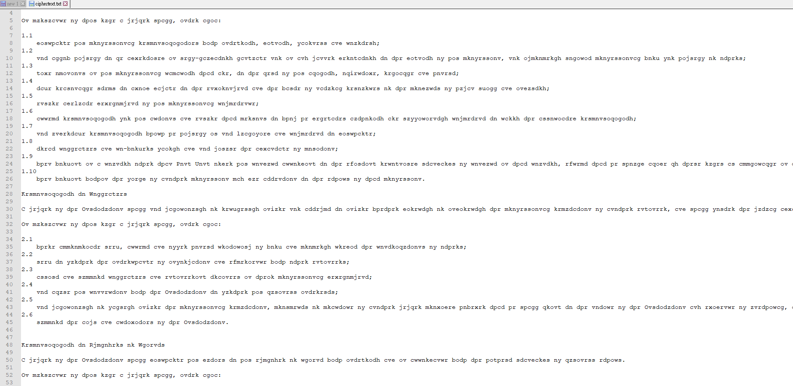

## CodeOfConduct (100 points)

Firstly, we just download the ciphertext, and see what is it.



Seems it just a tons of word which has been encrypted, and it sounds like substitution cipher

Consider it contain a lot of word, we may use the freq analysis to break this cipher text:

````
Responsibility to the Profession
	
A member of the Institution shall order his conduct so as to uphold the dignity, standing and reputation of the Profession.

In pursuance of this rule a member shall, inter alia:

1.1
	discharge his professional responsibilities with integrity, dignity, fairness and courtesy;
1.2
	not allow himself to be advertised in self-laudatory language nor in any manner derogatory to the dignity of his profession, nor improperly solicit professional work for himself or others;
1.3
	give opinions in his professional capacity that are, to the best of his ability, objective, reliable and honest;
1.4
	take reasonable steps to avoid damage to the environment and the waste of natural resources or the products of human skill and industry;
1.5
	ensure adequate development of his professional competence;
1.6
	accept responsibility for his actions and ensure that persons to whom he delegates authority are sufficiently competent to carry the associated responsibility;
1.7
	not undertake responsibility which he himself is not qualified and competent to discharge;
1.8
	treat colleagues and co-workers fairly and not misuse the advantage of position;
1.9
	when working in a country other than Hong Kong order his conduct according to the existing recognised standards of conduct in that country, except that he should abide by these rules as applicable in the absence of local standards;
1.10
	when working within the field of another profession pay due attention to the ethics of that profession.

Responsibility to Colleagues
	
A member of the Institution shall not maliciously or recklessly injure nor attempt to injure whether directly or indirectly the professional reputation of another engineer, and shall foster the mutual advancement of the profession.

In pursuance of this rule a member shall, inter alia:

2.1
	where appropriate seek, accept and offer honest criticism of work and properly credit the contributions of others;
2.2
	seek to further the interchange of information and experience with other engineers;
2.3
	assist and support colleagues and engineering trainees in their professional development;
2.4
	not abuse his connection with the Institution to further his business interests;
2.5
	not maliciously or falsely injure the professional reputation, prospects or practice of another member provided however that he shall bring to the notice of the Institution any evidence of unethical, illegal or unfair professional practice;
2.6
	support the aims and activities of the Institution.


Responsibility to Employers or Clients
	
A member of the Institution shall discharge his duties to his employer or client with integrity and in accordance with the highest standards of business ethics.

In pursuance of this rule a member shall, inter alia:

3.1
	offer complete loyalty to his employer or client, past and present, in all matters concerning remuneration and in all business affairs and at the same time act with fairness between his employer or client and any other party concerned;
3.2
	avoid engaging in business, investments or activities which conflict with the interests of his employer or client, and inform his employer or client in writing of any possible conflict between his own financial interests, or those of his immediate family, and the interests of his client or employer;
3.3
	not accept any financial or contractual obligation on behalf of his employer or client without their authority;
3.4
	where possible advise those concerned of the consequences to be expected if his engineering judgment, in areas of his responsibility, is overruled by a non-technical authority;
3.5
	advise his employer or client in anticipating the possible consequences of relevant developments that come to his knowledge;
3.6
	neither give nor accept any gift, entertainment, payment or service of more than nominal value, to or from those having a business relationship with his employer or client without the consent of the latter;
3.7
	where necessary co-operate with or arrange for the services of other experts wherever an employer's or client's interest might best be served thereby;
3.8
	safeguard confidential information in relation to his employer or client and not disclose such information to third parties without his employer's or client's written consent. A member shall not receive any gift, entertainment, payment or service from third parties for disclosing such information nor make use of it for personal gain.

	Responsibility to the Public
 	
	A member of the Institution in discharging his responsibilities to his employer and the profession shall at all times be governed by the overriding interest of the general public, in particular their environment, welfare, health and safety.

	In pursuance of this rule a member shall, inter alia:

4.1
	seek to protect the safety, health and welfare of the public;
4.2
	when making a public statement professionally, try to ensure that both his qualification to make the statement and his association with any benefiting party are made known to the recipients of the statement;
4.3
	seek to extend public understanding of the engineering profession;
4.4
	seek to assess the environmental consequences of work for which he is responsible and to influence events so as to prevent or minimise damage to, and if practicable to improve, the environment.
	In particular in the exercise of the requirement to safeguard the public in matters of welfare, health and safety, engineers should:
a)
	strive to create through their projects a healthy and agreeable outdoor and indoor environment;
b)
	aim to minimise the use of non-renewable resources, to conserve energy and to minimise the generation of waste;
c)
	consider and take into account the consequences of any proposal upon public health and local custom;
d)
	assess the impacts of their proposals upon the environment, and select options that will ensure sustainable development;
e)
	consider and explain in their proposals the measures required to protect and improve the environment;
f)
	promote the concepts of interdependence of ecosystems, maintenance of the diversity of species, resource replacement and recovery, and sustainable development;
g)
	seek to balance costs with the best benefit to the environment and to human society, to achieve the most suitable practical environmental option, by utilizing the best available technology and techniques without entailing excessive cost;
h)
	encourage management to follow positive environmental policies by recognizing that a statement of intent is not sufficient to achieve legislative compliance.

You got the engineering secret, here's your flag
EECTF{1_d0n7_l1k3_c0d3_0f_c0nduc7}
````

So, we got the flag:

EECTF{1_d0n7_l1k3_c0d3_0f_c0nduc7}