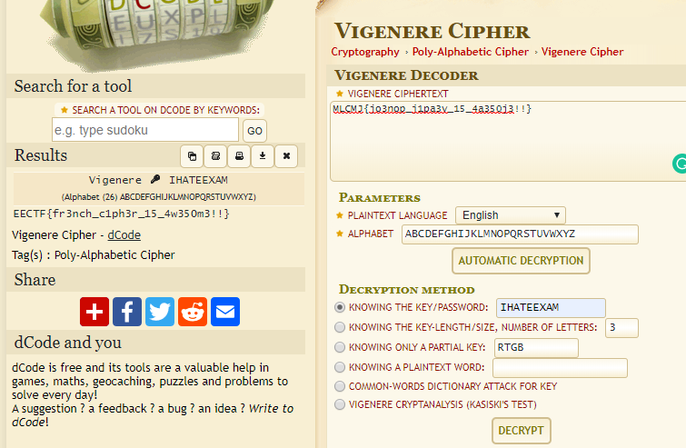

# Message_from_old_French (200 points)

First of all, let view the flag first:

MLCMJ{jo3nop_j1pa3v_15_4a350j3!!}

As we know the first five letter should be EECTF, and it seems like the Vigenere Cipher, one of the result that match EECTF is key "IHATEXXXX"

Let give a little bit guessing, we may guess the key is IHATEEXAM, and we got:

And we got the flag:

EECTF{fr3nch_c1ph3r_15_4w350m3!!}
