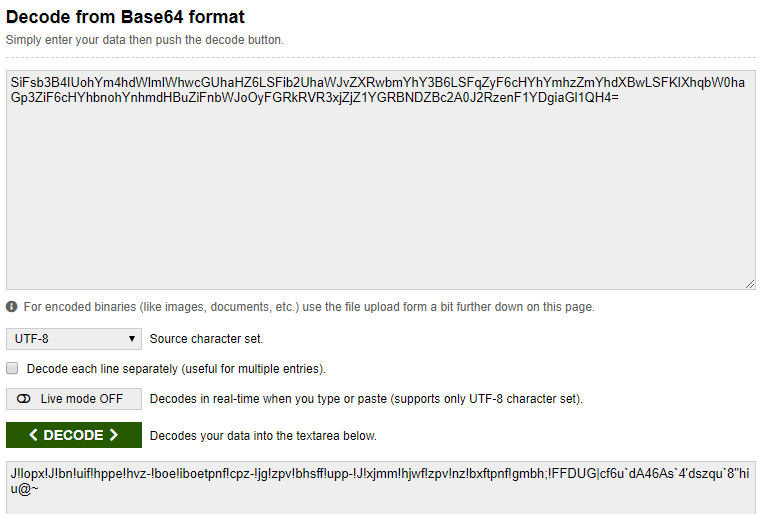
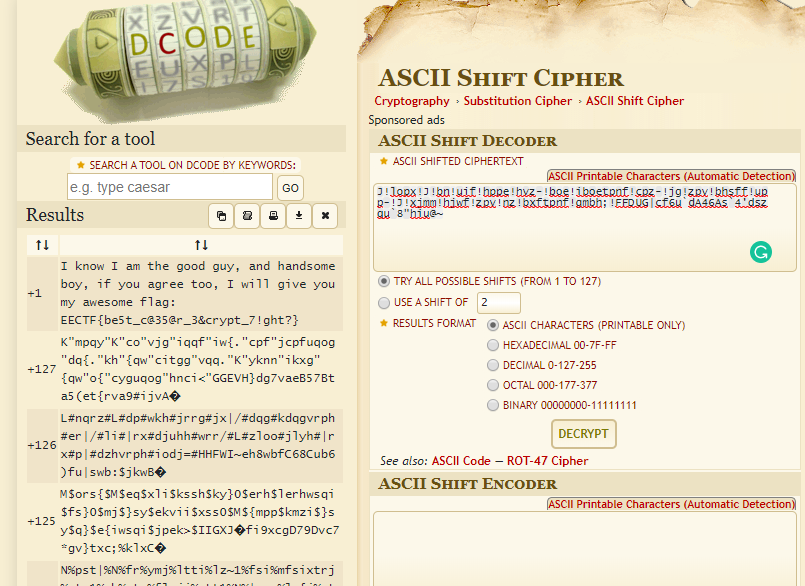

## VeryGoodCCCipher (200 points)

Firstly, let's look at our ciphertext:

SiFsb3B4IUohYm4hdWlmIWhwcGUhaHZ6LSFib2UhaWJvZXRwbmYhY3B6LSFqZyF6cHYhYmhzZmYhdXBwLSFKIXhqbW0haGp3ZiF6cHYhbnohYnhmdHBuZiFnbWJoOyFGRkRVR3xjZjZ1YGRBNDZBc2A0J2RzenF1YDgiaGl1QH4=

Seems it just a base64 encode, let us decode it first

Then, that string seems weird, so let us using ascii shift and see what we got:

Such that, we can see the flag now:

EECTF{be5t_c@35@r_3&crypt_7!ght?}