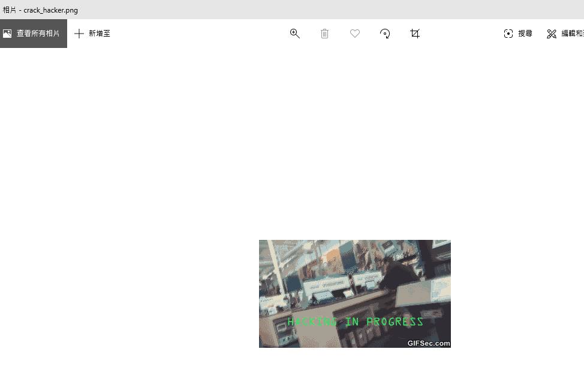
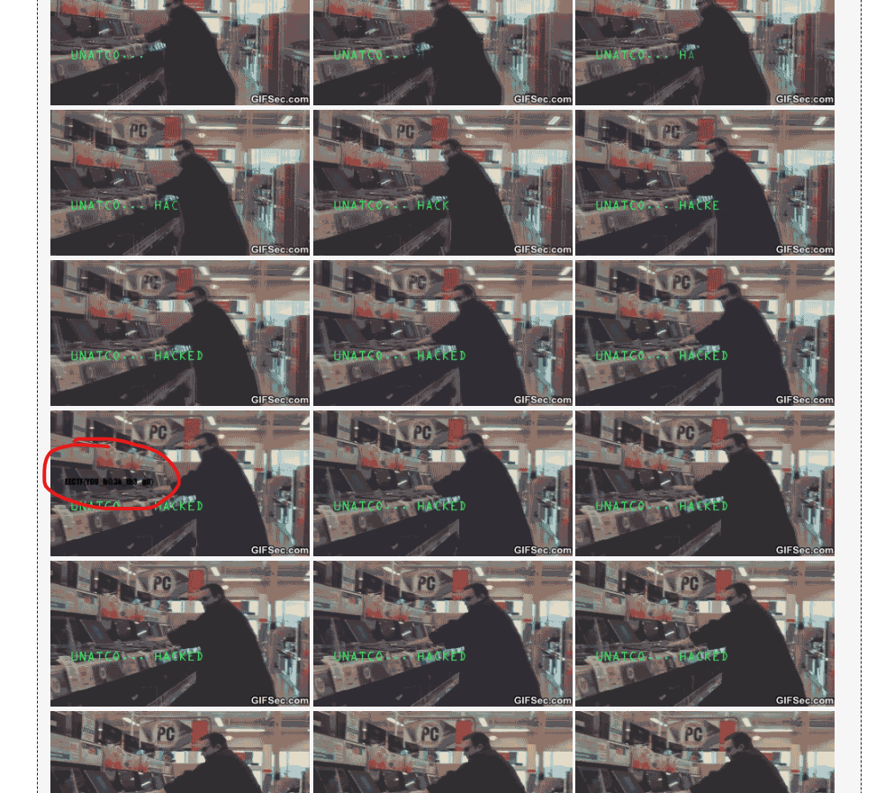

# Ethereal (700 points)

In the 

EECTF{FJsOnJG3CuC85}, flag len = 13 = 0x0d
EECTF{0afZ7wW6OXmhHV} flag len = 14 = 0x0e
EECTF{HcMiHZm1bO} flag len = 10 = 0x0a
EECTF{9Udo9GYTB4HdG} flag len = 13 = 0x0d
EECTF{JSzcNqC6SH9} flag len = 11 = 0x0b
EECTF{upGDrJ9YIa7wZE} flag len = 14 = 0x0e

EECTF{s6p7rOrrU9yQFP} flag len = 14 = 0x0e

EECTF{5l9OXaZJqjdraTb} flag len = 13 = 0x0f
EECTF{e7w9E5e} flag len = 7
EECTF{1V7NZwiib} flag len = 9
EECTF{5VW8MTyg} flag len = 8
EECTF{C0y79TI} flag len = 7

such that, we got the following sequence:

key: deadbeef7897

Also, we got the zip file too, so let us open the file with the password, and we will see the "png" file

Seems it's weird, so after the file signature analysis, seems it just a gif image

And finally, after some research on the image, seems we got:

on the red cicle, seems it contain a flag, so let's check it out and we got the flag:

EECTF{Y0U_H@3k_th3_g1f}