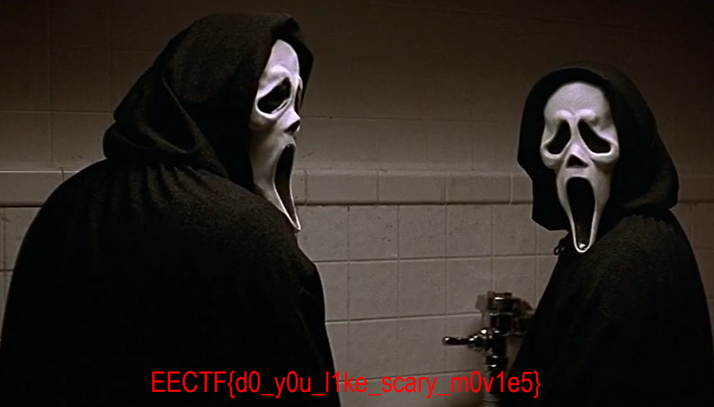

# Scream4 (200 points)

Students are given a file named "Scream4.png"

The bottom part  of the image is cut

Open a hex editor

Change value at 0x17 from 0x00 to 0x93

Flag: *EECTF{d0_y0u_l1ke_scary_m0v1e5}*

