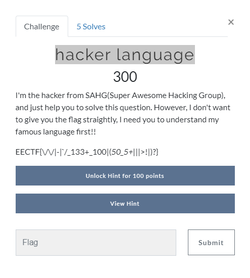

# hacker language (300 points)

Firstly, let's look at the image

Seems it just written by leet, in order to solve it, we may need a leet convertor tool, and bit more creative.

Flag:

EECTF{\/\/|-|`/_133+_100|(*50_5+|*||>!|)?}

Next, as the above said, let us open the convertor and translate it.

After the transformation, the string become:

EECTF{\/\/hy_leet_loo|cso_st||pidq?}

In this time, just need to add a bit more creative, and you'll get:

EECTF{why_leet_lookso_stupid?}

and that's the flag
