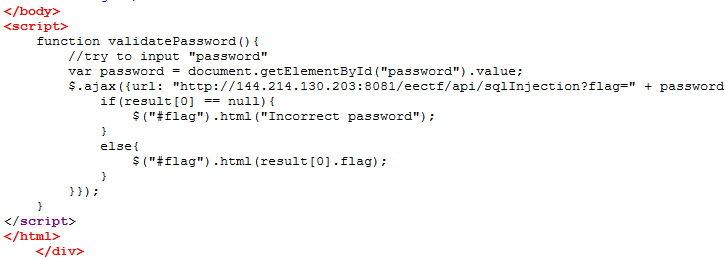
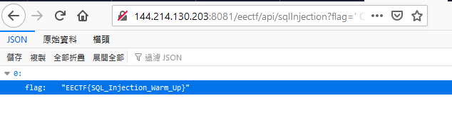

# SQL Injection 1 (100 points)

Check the source code and we can see the path

http://144.214.130.203:8081/eectf/api/sqlInjection?flag=

We can try to issue our query to this path with this payload

' OR NOT '

Flag: *EECTF{SQL_Injection_Warm_Up}*

