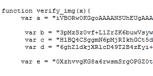
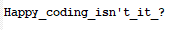

# Web Challenge 1 (100 points)

Check the source code and we can find var a - e

Concatenate a - e then we get the base64 format of an image (base64.txt)

Using convertor online, we obtain an image (flagImg.jpg)

Flag: *EECTF{Happy_coding_isn't_it_?}*

