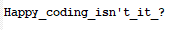

# Web Challenge 2 (200 points)

Call the function, create a var str and concat each char, alert it

An example code is attached (Refer to solution.html)

Using convertor online, we obtain an image (flagImg.jpg)

Flag: *EECTF{Happy_coding_isn't_it_?}*

